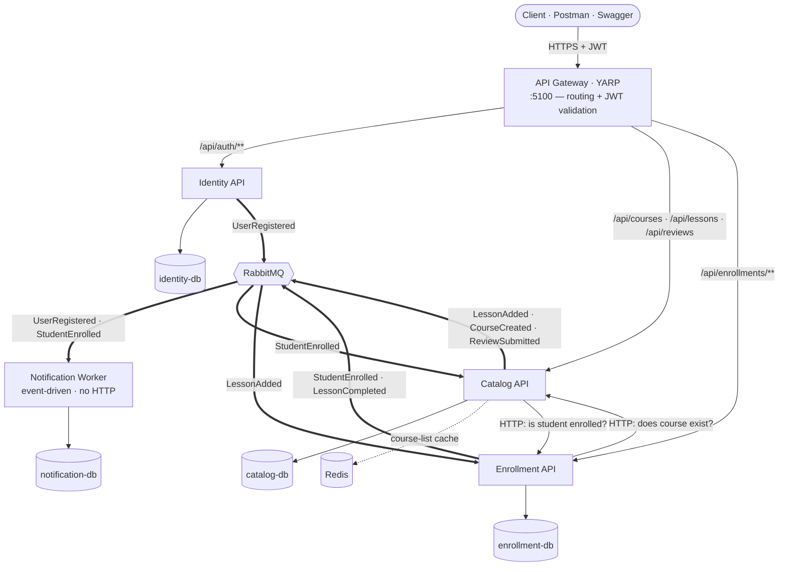

# Online Learning Platform

A microservices-based online learning platform built with .NET 10, demonstrating service decomposition, asynchronous event-driven messaging, database-per-service, and clean architecture principles.

> Second microservices project after [Restaurant Bill](https://github.com/fatihkayaci/RestaurantBill). Focus: backend architecture depth over feature breadth.

---

## Architecture overview

Four independent microservices behind a single API Gateway. Services communicate **synchronously over HTTP** when a caller needs an immediate answer, and **asynchronously over RabbitMQ** for side effects and eventual consistency. Each service owns its own PostgreSQL database — no service reads another service's database directly.



| Service | Responsibility | Owns | Listens to |
|---|---|---|---|
| **Identity** | Authentication, JWT issuance, user management | User, refresh tokens | — |
| **Catalog** | Courses, lessons, reviews | Course, Lesson, Review | `StudentEnrolled` (enrollment count) |
| **Enrollment** | Student enrollments and progress | Enrollment, Progress | `LessonAdded` (total lesson count) |
| **Notification** | Welcome/confirmation notifications (worker, no HTTP) | Notification log | `UserRegistered`, `StudentEnrolled` |
| **API Gateway (YARP)** | Single entry point, request routing, JWT validation | — | — |

Full architecture decisions, sequence diagrams, event catalog, and data ownership tables: see [`docs/architecture.md`](docs/architecture.md).

---

## Tech stack

**Per service**
- .NET 10, ASP.NET Core, EF Core, PostgreSQL
- MediatR (CQRS) with pipeline behaviors: **Validation**, **Performance** (slow-handler warnings), **Idempotency**
- FluentValidation
- Serilog (structured logging)

**Cross-cutting**
- API Gateway: **YARP** (reverse proxy + JWT validation)
- Messaging: **RabbitMQ** via the native `RabbitMQ.Client` (fanout exchanges, manual ack/nack) — see [ADR-002](docs/architecture.md#adr-002-rabbitmq-via-native-client-not-kafka-not-masstransit)
- Cache: **Redis** (Catalog course listings + idempotency keys)
- Idempotency: Redis-backed, applied to write commands via a MediatR behavior
- Auth: **JWT** with a shared signing key across services
- Logging: **Serilog + Seq**

**DevOps**
- Docker Compose (infrastructure: PostgreSQL ×4, RabbitMQ, Redis, Seq, pgAdmin)
- GitHub Actions (CI: restore → build → test on every push/PR)

**Testing**
- xUnit + FluentAssertions + NSubstitute (unit tests: handlers, validators, domain entities)

See the [roadmap](#roadmap) for what's deliberately not built yet (Polly resilience, OpenTelemetry, Outbox, Testcontainers, Azure deployment).

---

## Running locally

> Requires Docker Desktop and the .NET 10 SDK.

**1. Start the infrastructure** (databases, broker, cache, logging):

```bash
git clone https://github.com/fatihkayaci/learning-platform.git
cd learning-platform
docker-compose up -d
```

**2. Start the services** (each runs in its own terminal via the helper script):

```powershell
./run-services.ps1
```

This launches the Identity, Catalog, Enrollment, and Notification services. Start the gateway separately:

```bash
dotnet run --project src/ApiGateways/Gateway.Yarp
```

Databases are migrated and seeded automatically on startup.

**Endpoints:**

| Component | URL |
|---|---|
| API Gateway | http://localhost:5100 |
| Seq (logs UI) | http://localhost:5342 |
| RabbitMQ management | http://localhost:15672 |
| pgAdmin | http://localhost:5050 |

**Seed accounts** (all use password `Password123!`): `student1@example.com`, `student2@example.com`, `instructor1@example.com`, `instructor2@example.com`.

---

## Project status

Backend MVP complete — all 17 use cases implemented, unit-tested, and wired through the gateway.

- [x] Architecture design (`docs/architecture.md`)
- [x] Identity Service — register, login, JWT refresh token
- [x] Catalog Service — courses, lessons, reviews, role-based authorization
- [x] Enrollment Service — enroll, progress tracking, completion %
- [x] Notification Service — event-driven welcome & enrollment notifications
- [x] API Gateway (YARP) — routing + JWT validation
- [x] Async messaging (RabbitMQ) — 6-event catalog, producers + consumers
- [x] Cross-cutting — Redis cache, idempotency, MediatR pipeline behaviors, Serilog + Seq
- [x] Unit tests + GitHub Actions CI

See the [roadmap](#roadmap) below for what's next.

---

## Roadmap

Deliberately not built in the MVP, in rough priority order:

- [ ] **Health checks** — `/health` endpoints with DB / RabbitMQ / Redis readiness probes
- [ ] **Resilience** — Polly (or `Microsoft.Extensions.Http.Resilience`) retry + circuit breaker on cross-service HTTP calls
- [ ] **Distributed tracing** — OpenTelemetry + Jaeger/Tempo across the request path
- [ ] **Outbox pattern** — atomic DB-commit + event-publish (see [ADR-004](docs/architecture.md#adr-004-no-outbox-pattern-in-mvp))
- [ ] **Integration tests** — Testcontainers (real PostgreSQL + RabbitMQ)
- [ ] **Azure deployment** — Dockerfiles + Azure Container Apps (scale-to-zero)

---

## License

MIT
</content>
</invoke>
